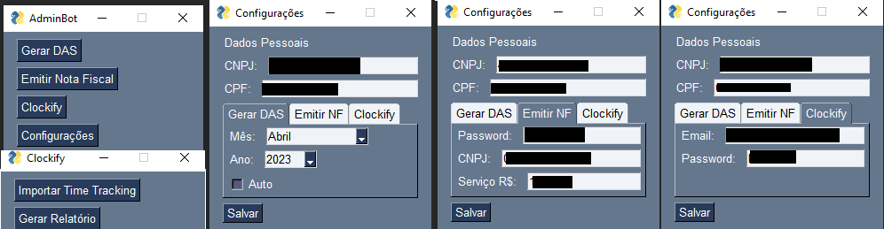

<h1 align="center">
  💻 AdminBot
</h1>

## 📚 O programa

- O **AdminBot** é um programa em Python que automatiza atividades administrativas em três sites diferentes, PGMEI, ISS Fortaleza e Clockify. 
- É possível escolher entre três automações ao se clicar em **Gerar DAS**, **Emitir Nota Fiscal**, **Clockify** > **Importar Time Tracking**;
- Ele executa tarefas como extração de arquivos, preenchimento de informações, login automático, entre outros. O programa também possui uma interface que permite ao usuário modificar as configurações de CPF, CNPJ, mês, ano, CNPJ do cliente, forma de pagamento, e-mail e senha, dependendo do site em questão.

---

## 💼 Tecnologias utilizadas

Para o desenvolvimento desta aplicação foi utilizado as seguintes tecnologias:

- **Python**: A linguagem de programação principal utilizada para desenvolver a aplicação;
- **PyAutoGui**: Uma biblioteca em Python para automação de tarefas, como movimento do mouse, cliques e digitação.;
- **PySimpleGUI**: Uma biblioteca em Python para criação de interfaces gráficas de usuário (GUI);
- **platform**: Um módulo Python para acessar informações sobre a plataforma em que o programa está sendo executado, como o sistema operacional;
- **OS**:  Um módulo Python para interagir com o sistema operacional, permitindo realizar operações como leitura de arquivos, criação de diretórios, etc.;
- **datetime**: Um módulo Python para trabalhar com datas e horários;
- **configparser**:  Um módulo Python para ler e escrever arquivos de configuração em formato INI;

---

<h2>Autores</h2>

<table>
  <tr>
    <td align="center">
      <a href="https://github.com/daniel-soaress">
         
        
          <b>Daniel Soares</b>
        
      </a>
    </td>
    <td align="center">
      <a href="https://github.com/Isaacvf-dev">
         
        
          <b>Isaac Vieira</b>
        
      </a>
    </td>
  </tr>
</table>